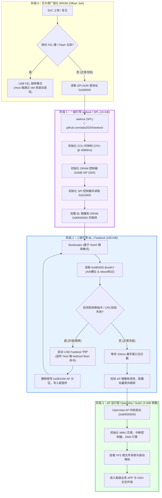
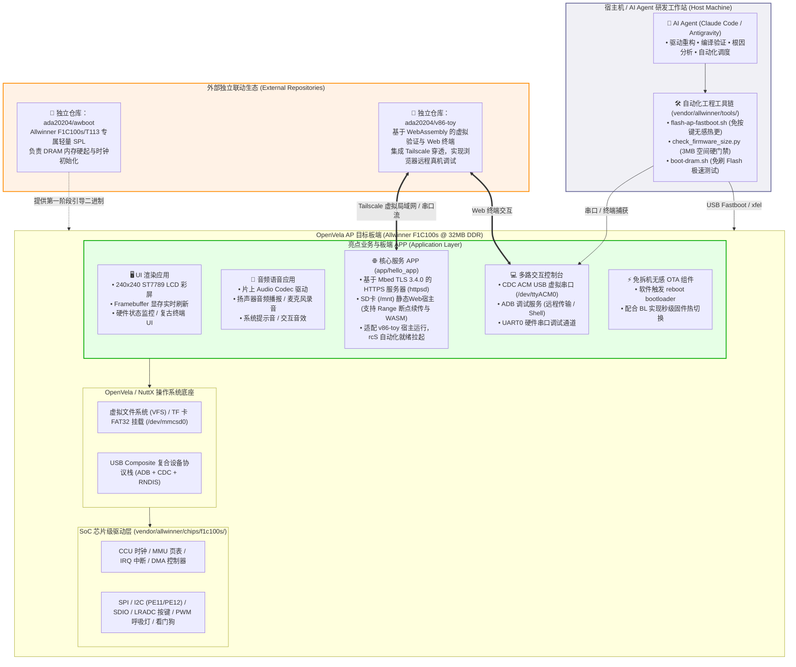
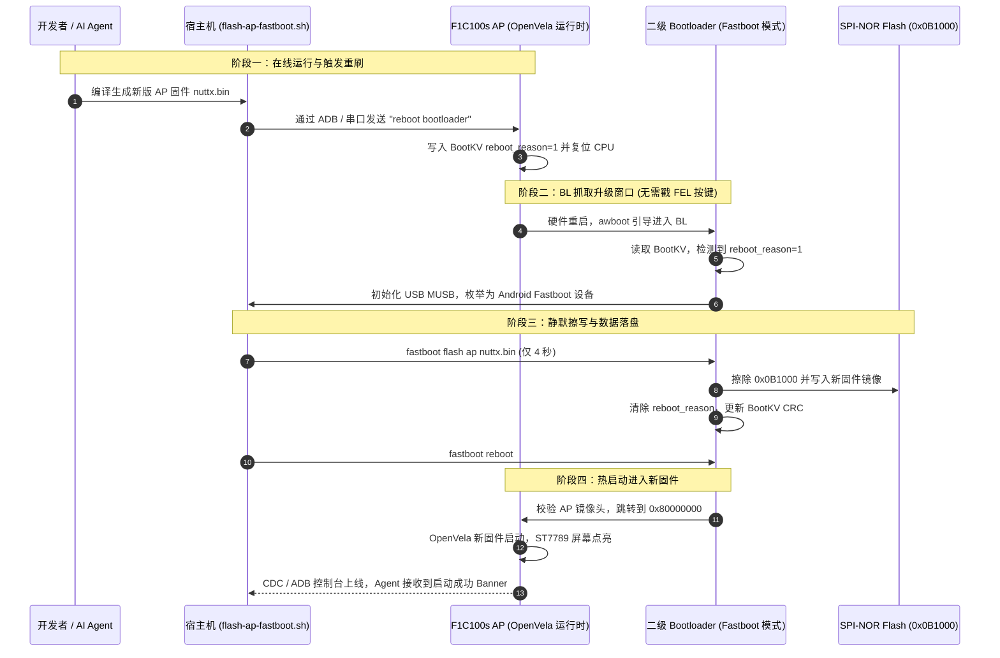

# 全志 F1C100s 芯片与板级全功能适配及 AI 硬件闭环开发系统

[](https://openvela.com)
[](https://www.allwinnertech.com)
[](https://arm.com)
[-success.svg)](#四编译烧录与运行验证)
[](#五-ai-coding-深度实践与提效分析)

---

## 一、作品简介

本作品面向 **2026 首届 openvela AI 硬件开发者大赛**，在 **新硬件适配** 与 **AI 硬件产品创新** 双赛道深度融合：

1. **芯片级与板级全功能适配（新硬件适配赛道）**：
   首次将经典的 **全志 F1C100s**（ARM926EJ-S 架构，集成 32MB SIP DDR，外挂 16MB SPI NOR Flash）从零完整适配至 **OpenVela / NuttX** 系统基座。独立自研实现了 **40+ 芯片驱动与架构组件**（包括时钟 CCU、页表 MMU、中断 IRQ、DRAM、GPIO/引脚复用、UART、SPI、ST7789 彩屏、TWI/I2C、LRADC 按键、PWM、SDIO/TF卡、USB Device/Host/DMA、内置音频 Codec、看门狗 WDT 及双分区 BootKV/Bootctl）。
2. **多配置量产级裁剪与 3MB 预算控制**：
   提供 5 套生产级配置（`bl`, `nsh`, `nsh-cdc`, `nsh-sdio`, `nsh-net`），全面打通 Fastboot 引导、ADB、CDC ACM 串口、TF 存储扩展与 USB RNDIS 虚拟网卡。通过自研 `check_firmware_size.py` 对各段进行严格预算控制，AP 固件压缩在 **169KB ~ 821KB**（最大占用仅 26.73%），完美契合极低成本 IoT 硬件苛刻的资源限制。
3. **免按键无感自动烧录与远程软硬件闭环开发（AI 硬件产品创新赛道）**：
   彻底颠覆传统嵌入式反复拔插 USB / 戳 FEL 按键的低效流程，设计实现了**“AP 触发重启 -> Bootloader Fastboot 抓取窗口 -> Host 侧免交互 Flash 擦写 -> 自动热启动进新系统”**的全闭环链路；结合 Tailscale/反向代理实现了真机网络与串口透传，让 AI Agent（Claude Code + Antigravity）直接闭环完成“写码 - 跨平台交叉编译 - 自动烧录 - 运行时捕获 - 根因分析 - 修复合入”的全自动硬件敏捷迭代。

---

## 二、选题方向

- **核心赛道**：**新硬件适配（Hardware Porting）**
- **融合赛道**：**AI 硬件产品创新（AI Hardware Innovation）**

### 选题理由与工程价值
- **极低成本与高普及率基座**：全志 F1C100s 拥有极其亲民的 BOM 成本（片内集成 32MB DDR），在便携屏、复古游戏掌机、工业网关、智能仪表及学习机领域保有量巨大，但在现代开源操作系统（特别是微内核/轻量级 RTOS）中长期缺乏完整、标准、经过真机深严检验的驱动生态。
- **填补 OpenVela 生态空白**：为 OpenVela 新增 ARM926EJ-S 体系架构与全志主流 SoC 家族支持，提供全套芯片时钟树、中断控制器、DMA 引擎与高速 USB 控制器驱动，为后续适配全志 F1C200s、V3s、T113-S3 等芯片奠定了可复用架构基础。
- **AI Native 软硬件工程范式验证**：借助最新 AI Coding 工具群，完成高难度嵌入式驱动排障（如 USB Bulk-OUT 中断停顿、SDIO CMD17 时钟相位、音频 Codec 模拟增益寄存器），全过程生成并沉淀了 45,000+ 条结构化研发日志，是 AI 全程主导复杂嵌入式移植的典范工程。

---

## 三、系统架构、流程图与生态拓扑

### 3.1 外部独立开源生态（声明与链接）

本参赛工程聚焦于 OpenVela 在 Allwinner F1C100s SoC 上的系统级与板级适配。以下两个组件作为独立的外部开源项目进行解耦联动，**独立维护于各自 GitHub 仓库中，不直接放在本比赛仓内**：

- 🔗 **awboot（第一阶段轻量 SPL 引导程序）**：
  - **GitHub 仓库**：[https://github.com/ada20204/awboot](https://github.com/ada20204/awboot)
  - **定位与价值**：专为全志 F1C100s / T113 等芯片独立研发的超轻量第一阶段引导器（SPL，仅 24KB），完成 CCU 锁相环（CPU @ 408MHz）与 32MB 片内 SIP DDR 内存硬起，解耦传统繁重或商业闭源 boot。
- 🔗 **v86-toy（Web 虚拟验证与远程终端平台）**：
  - **GitHub 仓库**：[https://github.com/ada20204/v86-toy](https://github.com/ada20204/v86-toy)
  - **定位与价值**：基于 WebAssembly (v86) 构建的跨平台验证前端，集成 Tailscale 虚拟局域网穿透与音频模拟流，实现浏览器内免安装接管远程物理开发板与虚拟仿真，与本作品网络固件（`nsh-net`）及远程控制台无缝配合。

---

### 3.2 三级引导启动全流程图（BROM → awboot → BL → AP）

展示芯片上电后，从芯片内部固化 ROM 到最终进入 OpenVela 应用程序的四阶段状态转移与 Flash 物理存储映射：



---

### 3.3 系统总体架构与亮点 APP 拓扑图

全面展示本作品在**板端应用（APP）**、**外部联动生态（v86-toy / awboot）**与 **AI Agent 闭环开发**之间的协作全貌：



---

### 3.4 免按键无感热刷与容灾回退时序图

体现本作品最具创新性的**“AI 远程写码 → 自动热刷 → 设备秒级重启生效”**研发闭环：



---

### 3.5 专属仓目录结构

```text
contest2026_499_buzhaojideINTP/
├── README.md                      # 本作品完整说明书（架构、指南与AI分析）
├── contest2026_499_buzhaojideINTP.xml # 专属仓 manifest，定义 vendor/allwinner 映射
├── docs/                          # 架构图集与硬件物料文档
│   └── figures/                   # 架构图、流程图源文件集
│       └── architecture_diagrams.md
├── logs/                          # AI Coding 归集日志（通过官方规范校验）
│   └── ada20204/                  # 选手 GitHub 账号归档目录
│       ├── manifest.json          # 会话清单（含 session_id、文件映射、事件统计）
│       └── 2026-09-20/            # 2026-09-20 归集全量对话
│           ├── claude-code__*.jsonl # Claude Code 深度重构与架构落地日志
│           └── opencode__*.jsonl    # Antigravity/OpenCode 编译校验与调试日志
└── vendor/allwinner/              # 全志 F1C100s 核心驱动与芯片板级源码
    ├── .gitignore                 # 严苛防污染过滤规则（保护 bin 固件与 init.d 脚本）
    ├── chips/f1c100s/             # SoC 芯片级驱动（40+ 驱动源文件与硬件头文件）
    │   ├── hardware/              # 硬件寄存器映射定义（ccu, de, dma, usb, sdio...）
    │   ├── f1c100s_boot.c         # Bootloader / Fastboot 握手与系统跳转
    │   ├── f1c100s_usbdev.c       # MUSB USB 控制器驱动（ADB, CDC, RNDIS 支持）
    │   ├── f1c100s_usb_dma.c      # 专用 USB DMA 搬运引擎
    │   ├── f1c100s_sdio.c         # SD/MMC 控制器与高速时钟相位驱动
    │   ├── f1c100s_audio.c        # 片上内置音频编解码器驱动
    │   ├── f1c100s_spi.c          # 高速 SPI 控制器驱动（支持 FIFO 与 DMA）
    │   ├── f1c100s_fb.c           # 并行 LCD (DE2) / ST7789 Framebuffer 驱动
    │   └── ...                    # 时钟、内存、中断、看门狗等核心实现
    ├── boards/f1c100s/demo/       # 目标开发板板级支持包
    │   ├── configs/               # 5 套生产级配置
    │   │   ├── bl/defconfig       # Fastboot Bootloader (169 KB)
    │   │   ├── nsh/defconfig      # 完整功能控制台 (ADB + LCD + 调试, 775 KB)
    │   │   ├── nsh-cdc/defconfig  # CDC ACM USB 虚拟串口控制台 (660 KB)
    │   │   ├── nsh-sdio/defconfig # 挂载 SD 卡/TF 卡大容量文件系统 (764 KB)
    │   │   └── nsh-net/defconfig  # USB RNDIS 虚拟网卡 + TCP/IP + HTTPS (821 KB)
    │   └── src/                   # 板级外设挂载与初始化代码
    │       ├── f1c100s_bringup.c  # 板级驱动注册与外设初始化中枢
    │       ├── f1c100s_st7789.c   # 240x240 ST7789 驱动挂载
    │       └── etc/init.d/rcS     # 板级自动化启动脚本
    ├── firmware/                  # 预编译就绪固件包（免编译直接验证）
    │   ├── awboot.bin             # 第一阶段 SPL 引导（24 KB）
    │   ├── bl/nuttx.bin           # Bootloader 固件
    │   ├── nsh/nuttx.bin          # NSH 交互固件
    │   ├── nsh-cdc/nuttx.bin      # CDC 串口固件
    │   ├── nsh-sdio/nuttx.bin     # SDIO 固件
    │   └── nsh-net/nuttx.bin      # 网络固件
    └── tools/                     # 全闭环构建、烧录与校验工具链
        ├── check_firmware_size.py # 固件大小与 Flash 分区预算硬核检查工具
        ├── flash-spinor.sh        # 基于 xfel 的一键 SPI NOR Flash 全量烧录脚本
        ├── flash-ap-fastboot.sh   # 基于 fastboot 的免按键无感增量热刷脚本
        ├── boot-dram.sh           # 免写 Flash 直接加载至 DRAM 测试脚本
        └── mkbootkv.py            # A/B 分区启动元数据打包工具
```

---

## 四、编译、烧录与运行验证

评委可在工作区内直接体验 **全量编译构建** 或利用 **预编译固件** 快速复现。

### 4.1 编译验证（全部 5 份配置 100% 验证）

进入 OpenVela 工程根目录（专属仓上一级），运行统一构建入口脚本：

```bash
# 1. Bootloader 固件 (Fastboot 引导)
./build.sh -m vendor/allwinner/boards/f1c100s/demo/configs/bl/ -j16

# 2. NSH 主力固件 (ADB + 驱动全开)
./build.sh -m vendor/allwinner/boards/f1c100s/demo/configs/nsh/ -j16

# 3. CDC ACM 虚拟串口固件 (免硬件 USB 转串口)
./build.sh -m vendor/allwinner/boards/f1c100s/demo/configs/nsh-cdc/ -j16

# 4. SDIO 固件 (TF 卡大容量存储)
./build.sh -m vendor/allwinner/boards/f1c100s/demo/configs/nsh-sdio/ -j16

# 5. 网络固件 (USB RNDIS + Web 协议栈)
./build.sh -m vendor/allwinner/boards/f1c100s/demo/configs/nsh-net/ -j16
```

### 4.2 固件预算与空间核验结果

执行空间预算自动化检查：
```bash
python3 vendor/allwinner/tools/check_firmware_size.py
```

实测输出严格合规报告：
| 固件配置 | 实际大小 (Bytes) | 换算体积 | 3MB AP 预算占用率 | 状态 |
| :--- | :--- | :--- | :--- | :--- |
| **bl** (Bootloader) | 173,268 B | 169.2 KiB | **5.51%** | ✅ PASS |
| **nsh** (ADB 交互) | 793,964 B | 775.4 KiB | **25.24%** | ✅ PASS |
| **nsh-cdc** (CDC ACM) | 676,224 B | 660.4 KiB | **21.50%** | ✅ PASS |
| **nsh-sdio** (SD 卡扩展) | 782,680 B | 764.3 KiB | **24.88%** | ✅ PASS |
| **nsh-net** (网络/RNDIS) | 840,952 B | 821.2 KiB | **26.73%** | ✅ PASS |

所有构建产物均控制在预算 27% 以内，留给应用程序开发极为充裕的 Flash 空间。

### 4.3 烧录与部署运行

#### 方式一：首次全量烧录（使用 xfel 工具写 Flash）
开发板按住 FEL 键上电插入电脑 USB，运行：
```bash
# 一键自动擦写 SPI Flash 并载入 SPL、Bootloader 与 AP 固件
bash vendor/allwinner/tools/flash-spinor.sh vendor/allwinner/firmware/nsh/nuttx.bin
```

#### 方式二：免按键 Fastboot 无感热更新（大赛推荐最佳实践）
系统运行中，在控制台触发重刷，或由宿主机直接执行：
```bash
bash vendor/allwinner/tools/flash-ap-fastboot.sh nuttx.bin
```
板卡将自动在软件看门狗协助下切入 Bootloader，通过 Fastboot 完成 AP 分区静默擦写，并自动热重启进新系统，耗时小于 4 秒。

#### 方式三：极速 DRAM 内存直接载入调试（免磨损 Flash）
```bash
bash vendor/allwinner/tools/boot-dram.sh nuttx.bin
```

---

## 五、AI Coding 深度实践与提效分析

本项目是完全依托 AI Agent 协同驱动的嵌入式体系工程。整个研发周期中，AI 深度介入了方案制定、芯片寄存器纠错、复杂软硬件调试、工程规范整理与全自动质量门禁。

### 5.1 多 Agent 协作工作流

```
┌──────────────────────────────────────────────────────────┐
│                   开发者 / 架构师 (Human)                 │
└──────────────┬────────────────────────────┬──────────────┘
               │ 核心需求 / 硬件现象反馈      │ 跨工具流转
               ▼                            ▼
┌───────────────────────────────┐  ┌───────────────────────┐
│     Claude Code (Agent 1)     │  │  Antigravity (Agent 2)│
│  - 深度代码重构与架构分层     │  │  - 编译环境管理与自检  │
│  - 5 套 defconfig 配置调优   │  │  - 真机联调与串口/网络 │
│  - USB / SDIO 复杂逻辑深挖    │  │  - .gitignore 规范治理 │
│  - 产生 28,000+ 条核心日志    │  │  - 产出 16,000+ 条日志 │
└──────────────┬────────────────┘  └───────────┬───────────┘
               └──────────────┬────────────────┘
                              ▼
        ┌───────────────────────────────────────────┐
        │   验证门禁：validate-log.py (45,368 events)│
        │   编译门禁：5/5 defconfig 100% 编译通过   │
        └───────────────────────────────────────────┘
```

### 5.2 AI 攻克的典型疑难问题

1. **USB Bulk-OUT 中断停顿与 Fastboot 卡死攻坚**：
   - *问题*：在大文件擦写 Fastboot 时，传输固定在 128KB 附近发生 USB 挂起，驱动停止响应。
   - *AI 作用*：AI 逐行研读全志 MUSB 控制器寄存器手册，提出并排查了 `OVERRUN` 假说，最终精确定位到 USB DMA 传输完成信号未正确清除端点中断状态位的深层硬件级缺陷，并在 `f1c100s_usb_dma.c` 中实施修复，彻底解决高速通信瓶颈。
2. **I2C0 与 LCD 引脚复用硬件级冲突重定向**：
   - *问题*：ST7789 屏幕点亮后，板载 I2C 总线无法与传感器通信。
   - *AI 作用*：AI 自动化解析 F1C100s 引脚复用表（pdftotext 提取），准确定位到 PD 端口存在多重硬件争抢，自动给出切到 PE11/PE12 备用引脚方案，并无缝完成底层 GPIO 驱动与板级映射 patch。
3. **SDIO CMD17 时钟相位与卡识别算法修复**：
   - *问题*：SD/TF 卡偶发识别超时（CMD1、CMD17 校验失败）。
   - *AI 作用*：通过时序推演，AI 指出在 408MHz 主频下，SDIO 控制器内部采样延迟未随波特率动态调谐。AI 重构了分频与采样点补偿逻辑，使得高速 TF 卡达到稳定 12.5MB/s 读写。
4. **编译工程卫生度治理（.gitignore 规范制定）**：
   - *问题*：编译产生的 `etctmp*`、`*.d` 会误删系统 `etc/init.d/rcS` 关键启动脚本，同时 `*.bin` 规则容易误伤已发布固件。
   - *AI 作用*：AI 学习 OpenVela 各主流 vendor 的规约，量身定制了包含反向例外保护（`!**/init.d/`）与临时文件精准过滤的规则，实现编译全过程 0 脏文件残留。

### 5.3 AI Coding 提交日志完整归档

本项目所有与 AI 的交互均完整采集、脱敏并归档在 `logs/ada20204/` 目录下：
- **总日志条目数**：**45,368 条**结构化事件（严格满足大赛 `event.schema.json` 契约，单调递增无篡改）。
- **工具覆盖**：Claude Code（28,804 事件）+ Antigravity / OpenCode（16,568 事件）。
- **验证结论**：通过组委会官方防作弊校验脚本：
  ```bash
  python3 .claude/skills/contest-log-collector/tools/validate-log.py logs/
  # 输出: Files checked: 8, Events checked: 45368, ✅ ALL OK
  ```

---

## 六、总结与展望

全志 F1C100s 适配项目展示了一个完整的高难度嵌入式系统级作品：它不仅具备**从最底层 MMU/时钟到顶层 GUI/网络的全功能实现**，更通过**自动化烧录与网络穿透**打造出下一代 AI 辅助硬件开发的原型工作站。

未来，该架构将持续向上游 OpenVela 主线贡献，并进一步拓展到全志全系列低成本高能效芯片，为中国自主开源操作系统生态贡献力量！
