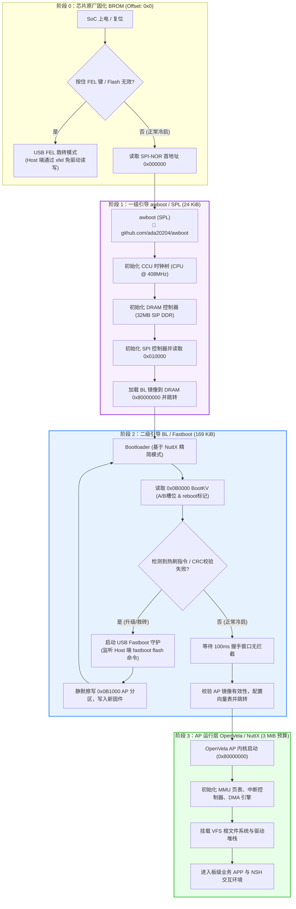
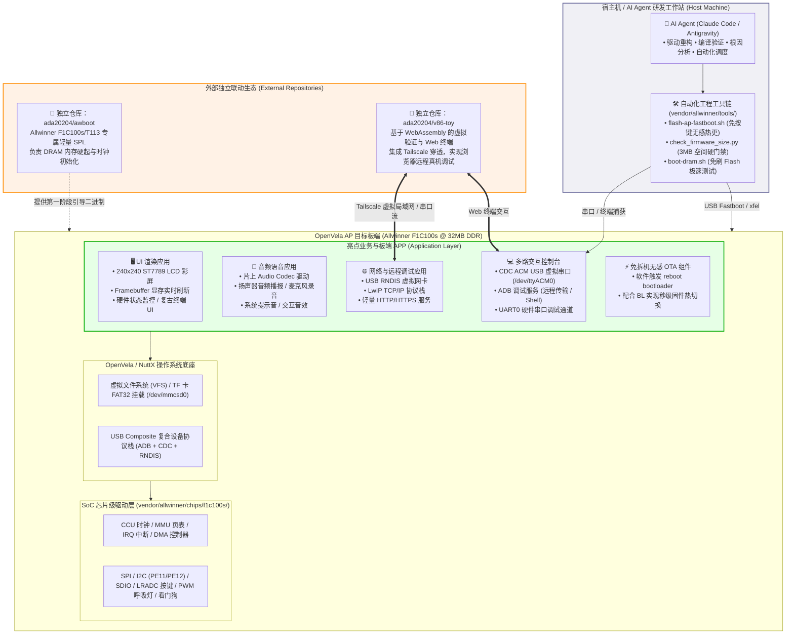
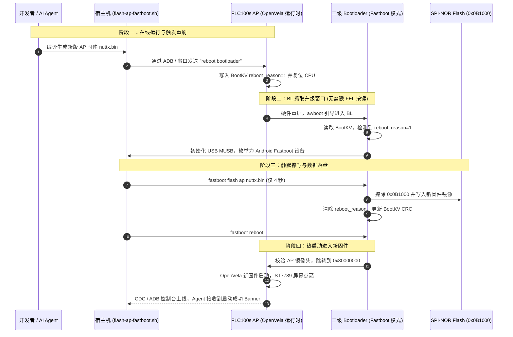

# OpenVela 全志 F1C100s 架构设计与关键流程图集

本图集为 **2026 首届 openvela AI 硬件开发者大赛**（队伍编号：`499`，队伍名：`buzhaojideINTP`）参赛作品的核心架构图与流程图，用于技术报告与专属仓文档。

---

## 外部独立开源生态（声明与链接）

本参赛工程聚焦于 OpenVela 在 Allwinner F1C100s SoC 上的系统级适配。以下两个组件作为独立的外部开源项目进行解耦联动，**不存放在本比赛仓内**：

- 🔗 **awboot（第一阶段轻量 SPL 引导程序）**：
  GitHub 地址：[https://github.com/ada20204/awboot](https://github.com/ada20204/awboot)
  功能：提供 24KB 极致自洽的一级启动器，完成 CCU 锁相环（408MHz）与 32MB 片内 SIP DDR 内存硬起，解耦商业闭源 boot。
- 🔗 **v86-toy（Web 虚拟验证与远程终端平台）**：
  GitHub 地址：[https://github.com/ada20204/v86-toy](https://github.com/ada20204/v86-toy)
  功能：基于 WebAssembly (v86) 构建的跨平台验证前端，集成 Tailscale 虚拟局域网穿透与音频模拟流，实现浏览器免安装接管远程物理开发板与虚拟仿真。

---

## 图 1：三级引导启动全流程图（BROM → awboot → BL → AP）

展示芯片上电后，从固化 ROM 到最终进入 OpenVela 应用程序的四阶段状态转移与物理存储映射：

---

## 图 2：系统总体架构与亮点 APP 拓扑图

全面展示本作品在**板端应用（APP）**、**外部联动生态（v86-toy / awboot）**与 **AI Agent 闭环开发**之间的协作全貌：

---

## 图 3：免按键无感热刷与容灾回退时序图

体现本作品最具创新性的**“AI 远程写码 → 自动热刷 → 设备秒级重启生效”**研发闭环：

